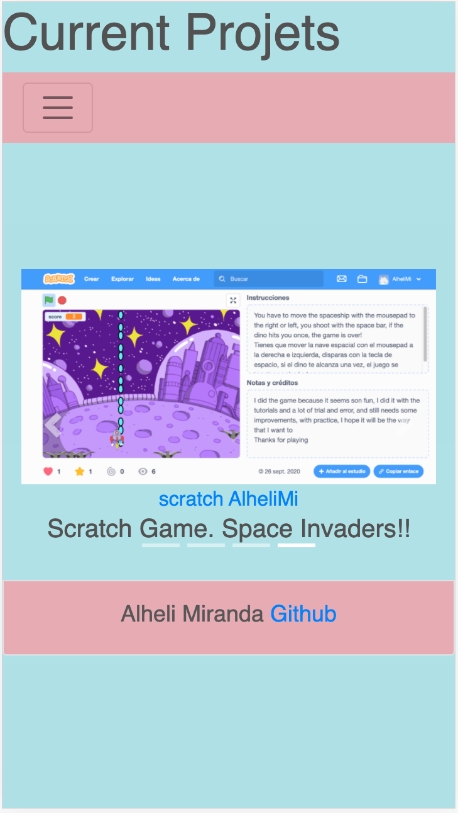

# Profile_Update

Update My Profile

# portfolio
responsive portfolio

# PORTFOLIO WEBPAGE

A portfolio is the organized collections of the document which might demonstrate your skills, work history and talents.
An Online, enables your credentials to be more easily accessible via the internet, can be very helpful to show your previous work and collaborations on the field.

 

## Process

The pages were designed by using Bootstrap layots, grids and content, utilities to develop the html and the style was using CSS, to customize the requirements of the page.

they are in the following files: `index.html`, `portfolio.html` and `contact_me.html`.

- This is the about me page, in wich I introduce myself and talk about myself, with responsive content

- This is the current projects page, in wich I introduce some of my previous work, with responsive content 

- This is the contact me page, in which one, you can contact me, and write a message, if you send me your data, still does not send me your input yet, but it seems like it does

## How does it looks?

go to the link to open on the browser
- https://alhelimi.github.io/Profile_Update/

## Credits 

To solve the needs to this subject, I use the following pages 
- https://www.w3schools.com/
- https://getbootstrap.com/

## Updates

The last portfolio I delivered, it was sort of incomplete because, the footer, did not stick at the bottom as sopouse to be, now is working properly, and also now is responsive completly, I added my latest projects

## Contributing

- https://alhelimi.github.io/portfolio/.
- https://github.com/AlheliMi/portfolio.git

Please feel free to pull, comment, add, update, discuss or even just chat @ alhealhe72@hotmail.com 